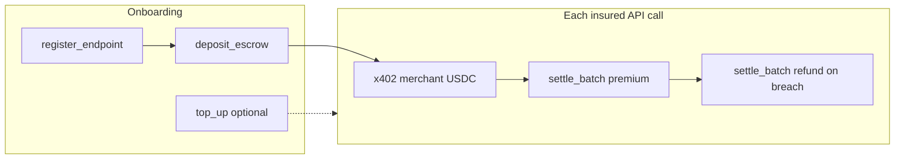
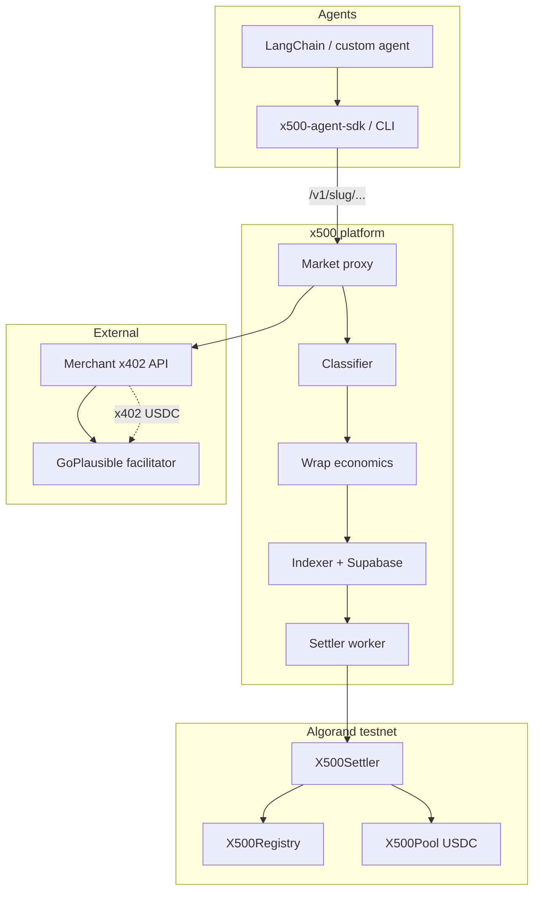
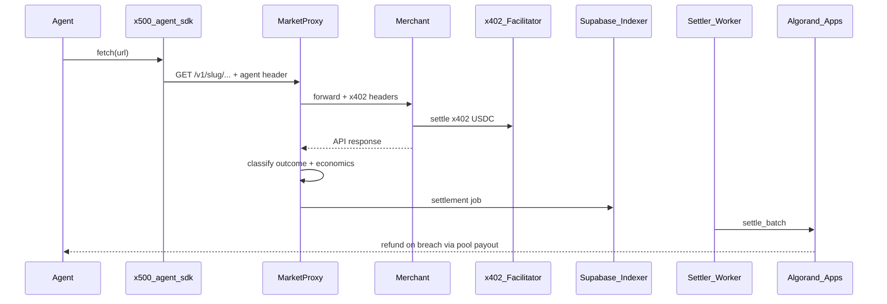
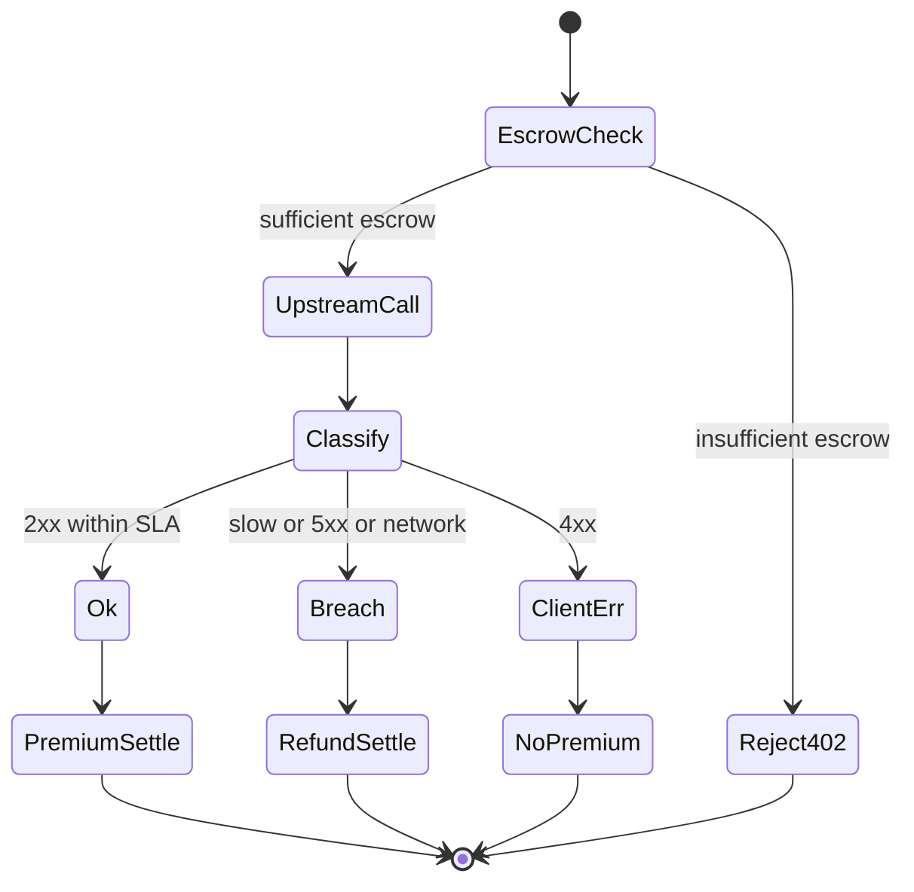
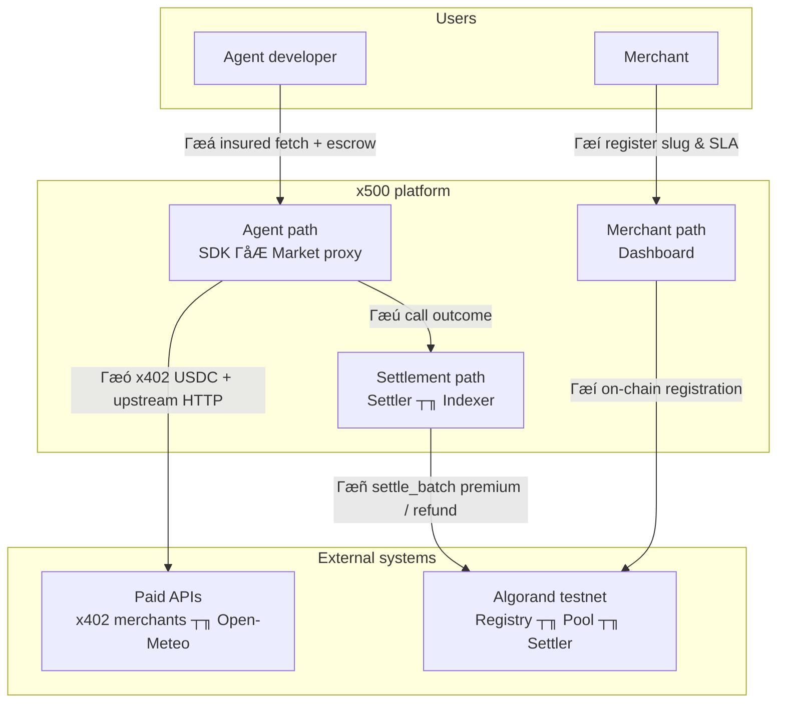
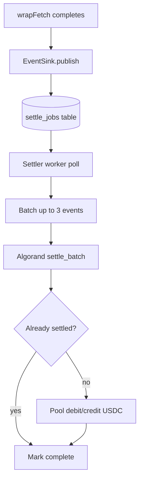
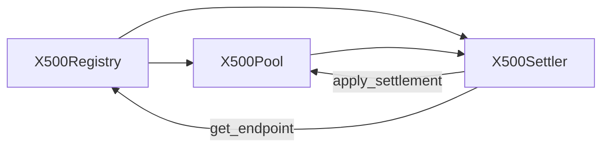

# x500

Micro-insurance for AI agent API payments on **Algorand testnet**.

When a paid service fails, a human can call customer support. Agents cannot. As agents pay for more APIs on their own ΓÇö weather, search, tools, data ΓÇö a failed or slow response after payment leaves them with no recourse. **x500** is micro-insurance for those calls: if the service fails or misses its SLA after the agent paid, the protocol refunds them automatically.

Merchant API payments use **x402 USDC** (testnet ASA `10458941`). Insurance premiums, escrow, and refunds use the same USDC ASA on-chain.

---

## Important Links

| Link | |
|------|---|
| npm x500-agent-sdk | [](https://www.npmjs.com/package/x500-agent-sdk) |
| npm x500-algorand | [](https://www.npmjs.com/package/x500-algorand) |
| npm protocol client | [](https://www.npmjs.com/package/x500-protocol-algorand-v1-client) |
| Lora explorer | [](https://lora.algokit.io/testnet) |
| Live Dashboard | [](https://dashboard-production-915f.up.railway.app/endpoints) |
| Live Chat Demo | [](https://chat-production-acf6.up.railway.app/) |

**Live testnet HTTP services (Railway):**

| Service | URL |
|---------|-----|
| Dashboard | `https://dashboard-production-915f.up.railway.app` |
| Chat (insured agent UI) | `https://chat-production-acf6.up.railway.app` |
| Indexer | `https://indexer-production-ab11.up.railway.app` |
| Market proxy | `https://market-proxy-production.up.railway.app` |
| x402 facilitator | `https://facilitator.goplausible.xyz` |

Try the **[live chat demo](https://chat-production-acf6.up.railway.app/)**: a Groq ReAct agent integrated with **x500-agent-sdk** calls registered merchants. Switch modes for **successful response** vs **SLA breach + refund**. Explore registrations, calls, and settlements on the **[live dashboard](https://dashboard-production-915f.up.railway.app/endpoints)**.

**Local dev:** `pnpm dashboard:dev` ┬╖ `pnpm chat:dev` (port 3002).

---

## Smart contracts (Algorand testnet)

Deployed **2026-08-18** ΓÇö canonical IDs in [`config/deployments.algorand.testnet.json`](config/deployments.algorand.testnet.json).

| Application | App ID | Address | Explorer |
|-------------|--------|---------|----------|
| X500Registry | `769438875` | `EBPIRPHIUBACGZBGAY7CYJRI6MNQSGGJDRAKDJLRDCZGSYKFA5YEDNZD4Q` | [](https://lora.algokit.io/testnet/application/769438875) |
| X500Pool | `769443375` | `A5P2L3XDNWCJC6XIK3TGBLBTPBTZRBVNRLDZXVYX7PGV4K6NHSSM2KU7MI` | [](https://lora.algokit.io/testnet/application/769443375) |
| X500Settler | `769443376` | `NFS5ZQRMO5GD2C64WJP5OZUKA3YJ74UY54SZNCJ74GYU3D4X6QPYTDHFDE` | [](https://lora.algokit.io/testnet/application/769443376) |

Protocol authority: `TRJXF5EDMGG3F3XU24LLS5ROYMBSYASM6SXHFE7WLH7HDKZ72HTIAB2ZLE`

Contracts are written in **Puya** ([`packages/protocol-algorand-v1/contracts`](packages/protocol-algorand-v1/contracts)). ABI method names use snake_case (`register_endpoint`, `deposit_escrow`, `settle_batch`).

---

## Important transactions (application lifecycle)

Real **testnet transaction IDs** from insured weather calls. Each link opens the transaction on [Lora](https://lora.algokit.io/testnet). Your own runs produce different IDs in the same format.



| Phase | What happens | On-chain / Algorand | Who signs | Example |
|-------|----------------|---------------------|-----------|---------|
| Merchant onboarding | Register slug, origin URL, API price (microUSDC), SLA, pay-to address | `X500Registry.register_endpoint` | Merchant wallet (Pera / Defly via [dashboard](https://dashboard-production-915f.up.railway.app/)) | See [Registry app](https://lora.algokit.io/testnet/application/769438875) |
| Agent setup | Prepay insurance premiums into USDC escrow | `X500Pool.deposit_escrow` (grouped ASA transfer) | Agent account (`x500-algorand approve` / SDK `setup()`) | See [Pool app](https://lora.algokit.io/testnet/application/769443375) |
| Paid API call | Agent pays merchant for the API response | x402 USDC via GoPlausible facilitator | Agent + facilitator | [HOT5NND…](https://lora.algokit.io/testnet/transaction/HOT5NNDNKVVLHLNTCQIUYMKVQ3PKRFMNOOKHC5KIGSWSQG4QUYJQ) |
| Insurance ΓÇö success | Premium debited from agent escrow, credited to pool | `X500Settler.settle_batch` | Settler worker | [Pool / Settler apps](https://lora.algokit.io/testnet/application/769443376) |
| Insurance — SLA breach | Refund to agent from pool (parametric) | `X500Settler.settle_batch` (refund leg) | Settler worker | [PG7Y5X…](https://lora.algokit.io/testnet/transaction/PG7Y5XUUUXRIFT5K2A2CPUSTDXQG4S4WPVRULAKN326IXYBEZ2WA) |

Example refund economics on the SLA breach tx: **0.005 USDC** x402 ticket + **0.010 USDC** premium = **0.015 USDC** total refund.

---

## Table of contents

- [Introduction](#introduction)
- [Problem](#problem)
- [Solution](#solution)
- [How an insured call works](#how-an-insured-call-works)
- [Outcome classification and economics](#outcome-classification-and-economics)
- [SDK and CLI](#sdk-and-cli)
- [Architecture overview](#architecture-overview)
- [HTTP headers reference](#http-headers-reference)
- [Algorand](#algorand)
- [Smart contracts (detailed)](#smart-contracts-detailed)
- [Full system](#full-system)
- [Indexer API reference](#indexer-api-reference)
- [Agent integration guide](#agent-integration-guide)
- [Merchant integration guide](#merchant-integration-guide)
- [Testing guide](#testing-guide)
- [Roadmap](#roadmap)
- [Conclusion](#conclusion)

---

## Introduction

x500 is an **insurance layer** between **AI agents** and **merchant APIs**. Agents call third-party paid APIs through an insured gateway; the protocol charges a flat insurance premium on covered outcomes and refunds agents parametrically when calls fail or breach SLA ΓÇö all settled on Algorand testnet in **USDC** (ASA `10458941`).

### Who uses x500

| Role | Goal | Primary tools |
|------|------|---------------|
| **Agent builder** | Insured `fetch` with refunds on failure | [x500-agent-sdk](https://www.npmjs.com/package/x500-agent-sdk), [x500-algorand](https://www.npmjs.com/package/x500-algorand) CLI |
| **Merchant** | List a paid API, receive x402 USDC | [Dashboard](https://dashboard-production-915f.up.railway.app/), own x402 server |

### Design principles

1. **Permissionless merchant registration** ΓÇö any wallet can `register_endpoint` on-chain.
2. **Separate payment rails** ΓÇö x402 USDC (merchant) vs pool escrow/settler (insurance).
3. **Parametric triggers** ΓÇö refunds follow a published outcome matrix, not manual claims.
4. **Idempotent settlement** ΓÇö each `callId` settles at most once on-chain (`is_settled`).
5. **Algod simulate reads** ΓÇö hot-path endpoint reads use algod simulate + box refs ([`AlgorandAdapter`](packages/shared/src/algorand-adapter.ts)); DB supplements SLA/economics when chain boxes are empty (`X500_PROXY_DB_ONLY=1`).

Merchant API payments use **x402 Exact AVM**. Insurance uses **`X500Pool`** USDC escrow and **`X500Settler.settle_batch`**.

---

## Problem

AI agents increasingly **pay for API access** ΓÇö weather, search, inference, commerce tools ΓÇö but the interaction model is brittle:

### Scenario A: Slow but paid

An agent pays a merchant **0.005 USDC** via x402 for a weather endpoint. The server accepts payment, then stalls for 20 seconds. The agent's SLA was 15 seconds. The merchant keeps the payment; the agent wasted time and money.

### Scenario B: Dead upstream

An agent routes through a registered slug. The merchant's tunnel died. The agent gets `network_error` but may have already committed to the call path; there is no standard refund mechanism.

### Scenario C: No economic SLA

HTTP status codes do not carry **insurance semantics**. A `502` from a merchant and a `404` from a bad agent request look similar at the transport layer but imply different fault models.

### Scenario D: Fragmented agent commerce

Each agent framework reinvents retries, budgets, and payment headers. There is no shared **outcome vocabulary** tied to on-chain settlement.

x500 addresses these by wrapping calls at a **market-proxy**, classifying outcomes, and settling **premiums and refunds** on Algorand with transparent rules.

---

## Solution

x500 inserts an **insured HTTP gateway** between agents and merchants:



**Core mechanisms:**

1. **Flat premium** ΓÇö prepaid from agent USDC escrow in `X500Pool` on covered successful calls.
2. **Outcome classifier** — maps HTTP status + latency → `ok`, `latency_breach`, `client_error`, `server_error`, `network_error`.
3. **Parametric settlement** ΓÇö `X500Settler.settle_batch` debits escrow, credits pool, refunds agent on covered breaches.
4. **Multi-merchant gateway** ΓÇö agents call `{proxy}/v1/{slug}/...`; merchants keep their own origin + x402 server.



---

## How an insured call works

Step-by-step for `GET /v1/{slug}/paid/weather?city=Paris`:

### Phase 1 ΓÇö Agent preparation

1. Agent wallet holds **USDC** (ASA `10458941`) for x402 merchant payments and **ALGO** for transaction fees.
2. Agent calls `x500-algorand approve` or SDK `setup()` → grouped ASA transfer + `X500Pool.deposit_escrow()` funds **insurance escrow** (USDC).
3. SDK resolves merchant origin URL → `slug` via indexer `GET /api/endpoints/resolve?origin=...`.
4. SDK builds insured URL: `{MARKET_PROXY_URL}/v1/{slug}/paid/weather?city=Paris`.
5. SDK attaches header `x-x500-agent-address: {agentAddress}`.

### Phase 2 ΓÇö Proxy routing

6. Market-proxy loads endpoint from chain + Supabase (`slug`, `hostname`, SLA, premium). With `X500_PROXY_DB_ONLY=1`, routing can use DB rows when on-chain registry boxes are empty.
7. Proxy checks protocol not paused, endpoint not paused.
8. Proxy verifies agent escrow ≥ flat premium (simulate read on `X500Pool.escrow_of`).
9. Proxy forwards request to merchant `hostname` with x402 headers intact.

### Phase 3 ΓÇö Merchant + x402

10. Merchant returns `402 Payment Required` if unpaid.
11. SDK x402 client (`@x402/avm` ExactAvmScheme) signs payment; proxy forwards `PAYMENT-SIGNATURE` headers.
12. Merchant verifies payment via `@x402/hono`, settles through GoPlausible facilitator.
13. Facilitator settles USDC ASA transfer agent → merchant `contact_address`.
14. Merchant returns `200` JSON (weather data).

**Slow merchant note:** [`example/server/src/app-slow.ts`](example/server/src/app-slow.ts) runs x402 verify + settle **before** the intentional 20s delay so the facilitator does not fail mid-handler. Insurance latency is measured wall-clock from proxy start through the full upstream response.

### Phase 4 ΓÇö Classification + economics

15. `wrapFetch` measures wall-clock latency from proxy start to upstream response.
16. Classifier applies decision tree (status, latency vs `sla_ms`).
17. Wrap computes premium and refund in **microUSDC** per outcome matrix (reads actual x402 amount from `PAYMENT-SIGNATURE` when present).
18. Proxy attaches `X-X500-*` response headers (see [HTTP headers](#http-headers-reference)).
19. Settlement event inserted into Supabase `settle_jobs` queue via indexer push.

### Phase 5 ΓÇö On-chain settlement

20. Settler worker claims jobs, batches up to **3** per `settle_batch` ([`MAX_BATCH_SIZE`](packages/settler/src/batcher.ts)).
21. `X500Settler` inner-calls `X500Pool.apply_settlement` ΓÇö debits agent escrow for premium (if non-zero).
22. Premium credited to endpoint pool; on covered breach pool pays USDC refund to agent.
23. `settledCalls` box marks `callId` done; indexer records `settlement_tx_id`.



---

## Outcome classification and economics

### Classifier decision tree

Source: [`packages/classifier/src/classify.ts`](packages/classifier/src/classify.ts). First match wins:

| Order | Condition | Core category | x500 outcome |
|-------|-----------|---------------|--------------|
| 1 | `networkError` or no status | `network_error` | `network_error` |
| 2 | HTTP 500ΓÇô599 | `server_error` | `server_error` |
| 3 | HTTP 400ΓÇô499 | `client_error` | `client_error` |
| 4 | HTTP 200ΓÇô299, latency > SLA | `slow` | `latency_breach` |
| 5 | HTTP 200ΓÇô299, latency Γëñ SLA | `success` | `ok` |
| 6 | Other (1xx, 3xx, etc.) | `other` | mapped per wrap |

### Outcome matrix (insurance)

Source: [`packages/wrap/src/economics.ts`](packages/wrap/src/economics.ts)

| Outcome | Premium charged? | Refund? | Covered breach? |
|---------|------------------|---------|-----------------|
| `ok` | Yes ΓÇö `flatPremiumMicroAlgos` | No | No |
| `latency_breach` | Yes | Yes ΓÇö x402 ticket + premium | Yes |
| `server_error` | Yes | Yes ΓÇö imputed + premium | Yes |
| `network_error` | Yes | Yes ΓÇö imputed + premium | Yes |
| `client_error` | **No** | No | No |

**Refund formula** (covered breaches):

```
latency_breach:
  principal = min(amountPaid from x402 ticket, imputedCostMicroAlgos)
  refund    = principal + flatPremiumMicroAlgos

server_error / network_error:
  principal = imputedCostMicroAlgos
  refund    = principal + flatPremiumMicroAlgos
```

- **`flatPremiumMicroAlgos`** ΓÇö default **10_000** microUSDC (0.01 USDC) at registration.
- **`imputedCostMicroAlgos`** ΓÇö default **100_000** microUSDC (0.1 USDC) ΓÇö refund principal cap.
- **`amountPaid`** ΓÇö parsed from `PAYMENT-SIGNATURE` / `PAYMENT-RESPONSE` on latency breach ([`x402PaymentAmount.ts`](packages/wrap/src/x402PaymentAmount.ts)).

Field names in code/API still use `*MicroAlgos` in several places; **amounts are microUSDC** (6 decimals) for insurance and merchant pricing in V1.

### Default protocol parameters (at deploy)

| Parameter | Default | Meaning |
|-----------|---------|---------|
| `DEFAULT_FLAT_PREMIUM` (registry) | 10_000 | 0.01 USDC insurance premium |
| `DEFAULT_IMPUTED_COST` (registry) | 100_000 | 0.1 USDC refund principal cap |
| Example API price | 5_000 | 0.005 USDC merchant x402 price |
| Example fast SLA | 60_000 ms | 60s (`pay-default`) |
| Example slow SLA | 15_000 ms | 15s (`weather-slow`) |
| `SETTLER_MAX_BATCH_SIZE` | 3 | Max events per `settle_batch` |
| USDC ASA | 10458941 | Testnet USDC asset id |

---

## SDK and CLI

### x500-agent-sdk

Published on npm: **[x500-agent-sdk](https://www.npmjs.com/package/x500-agent-sdk)** (v0.1.1)

```bash
npm i x500-agent-sdk
```

#### Minimal example

```ts
import { createX500 } from "x500-agent-sdk";

const x500 = createX500({
  network: "testnet",
  address: process.env.X500_AGENT_ADDRESS!,
  mnemonic: process.env.ALGORAND_AGENT_MNEMONIC!,
});

await x500.setup({ escrowMicroAlgos: 1_000_000n }); // 1 USDC escrow (microUSDC units)

x500.on("billed", (e) => {
  console.log(`premium ${e.premiumMicroAlgos} outcome=${e.outcome}`);
});
x500.on("refund", (e) => {
  console.log(`refund ${e.refundMicroAlgos} callId=${e.callId}`);
});

const res = await x500.fetch(
  "https://your-merchant.example/paid/weather?city=Paris",
);
console.log(await res.text());
await x500.close();
```

#### How the SDK is built

`createX500` in [`packages/x500-sdk-algorand/src/createX500.ts`](packages/x500-sdk-algorand/src/createX500.ts) layers:

| Layer | Package | Responsibility |
|-------|---------|----------------|
| Algorand signer | `algosdk` | Mnemonic account, grouped ASA + app calls |
| x402 client | `@x402/core`, `@x402/avm` | `ExactAvmScheme`, payment headers, facilitator verify |
| URL resolution | `resolveMerchant.ts` | Origin URL → slug + insured proxy base |
| HTTP | `wrapFetchWithPayment` | Retry 402 → pay → settle flow |

**Default service URLs** (override via env or options):

| Service | Default |
|---------|---------|
| Market proxy | `https://market-proxy-production.up.railway.app` |
| Indexer | `https://indexer-production-ab11.up.railway.app` |
| Facilitator | `https://facilitator.goplausible.xyz` |
| Pool app id | `769443375` |

#### SDK API reference

| Method | Signature | Description |
|--------|-----------|-------------|
| `fetch` | `(url, init?) → Response` | Insured fetch; auto-resolves merchant origins |
| `resolveMerchant` | `(origin) → { slug, hostname, insuredUrl, ... }` | Indexer lookup |
| `pay` | `(url, init?) → Response` | x402-only path (no insurance wrap) |
| `setup` | `({ escrowMicroAlgos? }) → { transactionId, loraUrl }` | USDC `deposit_escrow` on pool |
| `topUp` | `(microAlgos) → { transactionId, loraUrl }` | Additional escrow deposit |
| `getBalance` | `() → bigint` | Agent wallet **USDC** balance (microUSDC) |
| `getCall` | `(callId) → unknown` | Indexer `GET /api/calls/:id` |
| `getAgent` | `(address?) → unknown` | Indexer agent stats |
| `on` | `(event, handler) → unsubscribe` | `refund`, `billed`, `failure`, `degraded` |
| `close` | `() → void` | Release resources |

TypeScript event fields are named `premiumMicroAlgos` / `refundMicroAlgos`; values are **microUSDC**.

#### SDK events

| Event | When fired | Key fields |
|-------|------------|------------|
| `billed` | Premium > 0 on response | `premiumMicroAlgos`, `callId`, `outcome` |
| `refund` | Refund header > 0 | `refundMicroAlgos`, `callId` |
| `failure` | Non-2xx insured response | `status`, `outcome` |
| `degraded` | Settlement still pending | `callId` |

Environment variables: `X500_AGENT_ADDRESS`, `ALGORAND_AGENT_MNEMONIC`, optional `MARKET_PROXY_URL`, `INDEXER_URL`, `FACILITATOR_URL`, `X500_DEPLOYMENTS_PATH`, `X500_POOL_APP_ID`.

### x500-algorand CLI

Published on npm: **[x500-algorand](https://www.npmjs.com/package/x500-algorand)** (v0.1.3)

```bash
npm i -g x500-algorand
```

```bash
export X500_AGENT_ADDRESS=LGRB...
export ALGORAND_AGENT_MNEMONIC="25 word phrase ..."

x500-algorand --network testnet balance
x500-algorand --network testnet approve
x500-algorand --network testnet https://merchant.example/paid/weather?city=Tokyo
x500-algorand --network testnet /v1/my-slug/paid/weather?city=Tokyo
x500-algorand --network testnet pay https://merchant.example/paid/route
x500-algorand --network testnet calls show <callId>
x500-algorand --network testnet agents show [address]
```

V1 supports `--network testnet` only. Insurance and merchant amounts are **microUSDC** (ASA `10458941`). Agents still need **ALGO** for fees.

---

## Architecture overview

### System context diagram



**Reading the diagram:** agents enter through the SDK (Γæá), merchants register via the [dashboard](https://dashboard-production-915f.up.railway.app/) (Γæí), paid API traffic exits to upstream merchants (Γæó), outcomes flow to the settler (Γæú), and premiums/refunds land on Algorand (Γæñ).

### Live testnet services

| Service | URL | Purpose |
|---------|-----|---------|
| Market proxy | `https://market-proxy-production.up.railway.app` | Insured `/v1/{slug}/*` gateway |
| Indexer | `https://indexer-production-ab11.up.railway.app` | REST API + chain sync |
| Facilitator | `https://facilitator.goplausible.xyz` | x402 Exact AVM settlement (external) |
| Settler | Railway / local `8789` | `settle_batch` worker |
| Dashboard | [dashboard-production-915f.up.railway.app](https://dashboard-production-915f.up.railway.app/) ┬╖ local: `pnpm dashboard:dev` |
| Chat | [chat-production-acf6.up.railway.app](https://chat-production-acf6.up.railway.app/) ┬╖ local: `pnpm chat:dev` |

Set `MARKET_PROXY_URL`, `INDEXER_URL`, `NEXT_PUBLIC_INDEXER_URL` in `.env` for local dev (defaults `http://127.0.0.1:8788` / `8787`).

### Settlement pipeline



### Monorepo packages

| Package | Role |
|---------|------|
| `@x500/classifier` | HTTP outcome → neutral category |
| `@x500/wrap` | Premium/refund economics + `wrapFetch` |
| `@x500/shared` | `AlgorandAdapter` ΓÇö algod simulate reads + writes |
| `@x500/protocol-algorand-v1` | Puya smart contracts + compile |
| `x500-protocol-algorand-v1-client` | Encoders, indexer simulate helpers |
| `@x500/db-algorand` | Supabase migrations |
| `@x500/indexer` | NestJS API, `SyncService`, KPI routes |
| `@x500/settler` | Batched `settle_batch` worker |
| `@x500/market-proxy` | Insured multi-merchant HTTP gateway |
| `@x500/dummy-upstream` | Minimal demo merchant |
| `@x500/dashboard` | Next.js explorer + Pera/Defly registration |
| `@x500/chat` | Groq ReAct insured weather UI |
| `x500-agent-sdk` / `x500-algorand` | Published agent SDK + CLI |
| `example/` | Weather server + LangChain agent |

### Payment rails

| Rail | Who pays whom | When | Mechanism |
|------|---------------|------|-----------|
| Merchant API | Agent → merchant | During upstream HTTP call | x402 USDC via GoPlausible |
| Insurance premium | Agent escrow → pool | After classification | `settle_batch` |
| Insurance refund | Pool → agent | Covered breach | `settle_batch` payout |

### Agent call path

```
ΓöîΓöÇΓöÇΓöÇΓöÇΓöÇΓöÇΓöÇΓöÇΓöÇΓöÉ     ΓöîΓöÇΓöÇΓöÇΓöÇΓöÇΓöÇΓöÇΓöÇΓöÇΓöÇΓöÇΓöÇΓöÇΓöÇΓöÉ     ΓöîΓöÇΓöÇΓöÇΓöÇΓöÇΓöÇΓöÇΓöÇΓöÇΓöÇΓöÇΓöÇΓöÇΓöÇΓöÇΓöÇΓöÉ     ΓöîΓöÇΓöÇΓöÇΓöÇΓöÇΓöÇΓöÇΓöÇΓöÇΓöÇΓöÇΓöÉ
Γöé Agent   ΓöéΓöÇΓöÇΓöÇΓöÇΓû╢Γöé Market proxy ΓöéΓöÇΓöÇΓöÇΓöÇΓû╢Γöé Merchant x402  ΓöéΓöÇΓöÇΓöÇΓöÇΓû╢Γöé FacilitatorΓöé
Γöé + SDK   Γöé     Γöé /v1/{slug}   Γöé     Γöé origin URL     Γöé     Γöé (USDC)    Γöé
ΓööΓöÇΓöÇΓöÇΓöÇΓöÇΓöÇΓöÇΓöÇΓöÇΓöÿ     ΓööΓöÇΓöÇΓöÇΓöÇΓöÇΓöÇΓö¼ΓöÇΓöÇΓöÇΓöÇΓöÇΓöÇΓöÇΓöÿ     ΓööΓöÇΓöÇΓöÇΓöÇΓöÇΓöÇΓöÇΓöÇΓöÇΓöÇΓöÇΓöÇΓöÇΓöÇΓöÇΓöÇΓöÿ     ΓööΓöÇΓöÇΓöÇΓöÇΓöÇΓöÇΓöÇΓöÇΓöÇΓöÇΓöÇΓöÿ
                         Γöé
                         Γû╝
                  ΓöîΓöÇΓöÇΓöÇΓöÇΓöÇΓöÇΓöÇΓöÇΓöÇΓöÇΓöÇΓöÇΓöÇΓöÇΓöÉ     ΓöîΓöÇΓöÇΓöÇΓöÇΓöÇΓöÇΓöÇΓöÇΓöÇΓöÇΓöÉ     ΓöîΓöÇΓöÇΓöÇΓöÇΓöÇΓöÇΓöÇΓöÇΓöÇΓöÇΓöÇΓöÇΓöÇΓöÉ
                  Γöé wrapFetch    ΓöéΓöÇΓöÇΓöÇΓöÇΓû╢Γöé Supabase ΓöéΓöÇΓöÇΓöÇΓöÇΓû╢Γöé Settler     Γöé
                  Γöé classify     Γöé     Γöé jobs     Γöé     Γöé settle_batchΓöé
                  ΓööΓöÇΓöÇΓöÇΓöÇΓöÇΓöÇΓöÇΓöÇΓöÇΓöÇΓöÇΓöÇΓöÇΓöÇΓöÿ     ΓööΓöÇΓöÇΓöÇΓöÇΓöÇΓöÇΓöÇΓöÇΓöÇΓöÇΓöÿ     ΓööΓöÇΓöÇΓöÇΓöÇΓöÇΓöÇΓöÇΓöÇΓöÇΓöÇΓöÇΓöÇΓöÇΓöÿ
```

Agents pass `x-x500-agent-address`; the proxy forwards x402 payment headers upstream unchanged.

---

## HTTP headers reference

### Request headers (agent → proxy)

| Header | Required | Description |
|--------|----------|-------------|
| `x-x500-agent-address` | Yes (insured) | Algorand address ΓÇö escrow debited on settlement |
| `x-x500-beta-key` | If configured | Beta gate when `MARKET_PROXY_BETA_KEY` set |
| `PAYMENT-SIGNATURE` | x402 flow | Forwarded to merchant upstream |
| `payment-required` | x402 flow | Returned by merchant on 402 |

### Response headers (proxy → agent)

Source: [`packages/wrap/src/headers.ts`](packages/wrap/src/headers.ts)

| Header | Example | Description |
|--------|---------|-------------|
| `X-X500-Call-Id` | UUID bytes16 | Unique call identifier; maps to `settle_batch` |
| `X-X500-Outcome` | `ok` | `ok`, `latency_breach`, `client_error`, ... |
| `X-X500-Premium` | `10000` | Insurance premium microUSDC |
| `X-X500-Refund` | `15000` | Refund microUSDC (0 if none) |
| `X-X500-Latency-Ms` | `234` | Observed upstream RTT |
| `X-X500-Pool` | slug hex | Endpoint pool identifier |
| `X-X500-Asset` | `10458941` | Testnet USDC ASA id |
| `X-X500-Network` | `algorand:testnet` | Network tag |
| `X-X500-Settlement-Pending` | `1` | Present when on-chain settle not yet confirmed |

The SDK parses these headers to emit `billed` / `refund` events.

---

## Algorand

x500 V1 is built on **Algorand testnet**.

### Network and asset

| Concern | V1 choice |
|---------|-----------|
| Network | `algorand:testnet` |
| Merchant + insurance asset | Testnet USDC ASA **`10458941`** |
| Unit | **microUSDC** ΓÇö 1 USDC = 1_000_000 microUSDC (6 decimals) |
| Fees | Native **ALGO** for transaction fees |
| Keys | 25-word mnemonic → `algosdk` account (base32 address) |

### How Algorand is used per operation

| Operation | Algorand mechanism |
|-----------|-------------------|
| Read endpoint config | algod **simulate** + box refs |
| Read escrow balance | simulate `escrow_of` |
| Register endpoint | App call `register_endpoint` (Pera / Defly) |
| Deposit escrow | Grouped ASA transfer + `deposit_escrow` |
| x402 payment | ASA transfer via GoPlausible facilitator |
| settle_batch | App call on Settler → inner pool `apply_settlement` |
| Deploy apps | `pnpm protocol:deploy` |

The indexer **reads** chain into Supabase (`SyncService`); it does **not** submit on-chain transactions. Event ingest (`POST /events`) updates calls/agents and must not overwrite endpoint SLA/imputed when economics are omitted in the payload.

### Account roles (typical deployment)

| Account | Env var | Role |
|---------|---------|------|
| Operator / authority | `ALGORAND_OPERATOR_ADDRESS` | Deploy, `top_up`, protocol pause |
| Settler | `ALGORAND_SETTLER_ADDRESS` + `ALGORAND_SETTLER_MNEMONIC` | Signs `settle_batch` |
| Agent | `X500_AGENT_ADDRESS` / `ALGORAND_AGENT_MNEMONIC` | x402 payer + escrow owner |
| Merchant | `contact_address` on-chain | x402 pay-to |

### x402 on Algorand

x500 uses [**x402 Exact AVM**](https://www.npmjs.com/package/@x402/avm):

- Asset: testnet USDC ASA `10458941`
- Network: `algorand:SGO1GKSzyE7IEPItTxCByw9x8FmnrCDexi9/cOUJOiI=` (testnet CAIP-2)
- Facilitator: `https://facilitator.goplausible.xyz`
- Merchant server uses `@x402/hono` + `ExactAvmScheme` ([`example/server/src/app.ts`](example/server/src/app.ts))

**In scope for V1:** Algorand testnet, USDC merchant payments, USDC insurance escrow.

**Out of scope for V1:** mainnet, native ALGO as merchant payment asset, in-repo facilitator (external GoPlausible).

---

## Smart contracts (detailed)



### X500Registry

**Source:** [`packages/protocol-algorand-v1/contracts/X500Registry.algo.ts`](packages/protocol-algorand-v1/contracts/X500Registry.algo.ts)

On-chain catalog of insured merchant endpoints (box storage per slug).

#### Key functions

| Function | Access | Description |
|----------|--------|-------------|
| `register_endpoint` | Anyone | Self-serve merchant registration |
| `update_endpoint` | Owner | Hostname, price, contact address |
| `set_endpoint_sla` | Owner | Latency SLA in ms |
| `set_protocol_paused` | Authority | Global kill switch |
| `get_endpoint` | Readonly simulate | Full endpoint record |
| `slug_count` / `slug_at` | Readonly | Enumerate registered slugs |

#### Endpoint fields (conceptual)

| Field | Set at register | Notes |
|-------|-----------------|-------|
| `owner` | `Txn.sender` | Can update / pause |
| `hostname` | Yes | Absolute merchant origin URL |
| `apiPriceMicroUsdc` | Yes | Advertised x402 price |
| `contactAddress` | Yes | Merchant Algorand address (pay-to) |
| `slaLatencyMs` | Yes | SLA threshold in ms |
| `flatPremiumMicroAlgos` | Default 10_000 | Insurance premium (microUSDC) |
| `imputedCostMicroAlgos` | Default 100_000 | Refund principal cap |
| `paused` | false | Owner can pause |

### X500Pool

**Source:** [`packages/protocol-algorand-v1/contracts/X500Pool.algo.ts`](packages/protocol-algorand-v1/contracts/X500Pool.algo.ts)

USDC custody: per-endpoint pools + per-agent escrow boxes.

| Function | Access | Description |
|----------|--------|-------------|
| `deposit_escrow` | Agent | Grouped ASA transfer + escrow credit |
| `top_up` | Anyone (grouped axfer) | Fund endpoint pool liquidity |
| `apply_settlement` | Settler app | Debit escrow, credit pool, payout refund |
| `escrow_of` | Readonly | Agent escrow balance |
| `balance_of` | Readonly | Endpoint pool balance |
| `opt_in_usdc` | Ops | Pool opts into USDC ASA |

### X500Settler

**Source:** [`packages/protocol-algorand-v1/contracts/X500Settler.algo.ts`](packages/protocol-algorand-v1/contracts/X500Settler.algo.ts)

| Function | Access | Description |
|----------|--------|-------------|
| `settle_batch` | Settler authority | Process batch of settlement events |
| `is_settled` | Readonly | `callId` dedup check |

Each settle call carries: slug, agent, callId, premium, refund, latency, breach flag, fee metadata. Settler authority must match `Txn.sender` on `settle_batch`.

#### Access control

Settler authority wallet granted via `pnpm protocol:init` ΓÇö signs `settle_batch` app calls with `ALGORAND_SETTLER_MNEMONIC`.

---

## Full system

### 1. Merchant server

Merchants host their own API ΓÇö see [`example/server/src/app.ts`](example/server/src/app.ts).

**Requirements:**

- Public HTTPS origin (local `127.0.0.1:8800` OK for dev with DB registration)
- x402 on paid routes (`402` → pay → settle → `200`)
- `payTo` = `contact_address` from indexer registration

**Not required on merchant server:**

- x500 SDK, pool, settler, or indexer credentials
- Agent header handling (proxy adds/strips `x-x500-agent-address`)

**Lifecycle tx:** `register_endpoint`

### 2. Dashboard

**Live:** [dashboard-production-915f.up.railway.app](https://dashboard-production-915f.up.railway.app/) ┬╖ **Local dev:** `pnpm dashboard:dev`

[`packages/dashboard`](packages/dashboard) ΓÇö Next.js app.

| Route | Purpose |
|-------|---------|
| `/merchants/register` | Pera / Defly `register_endpoint` |
| `/endpoints`, `/calls`, `/agents` | Explorer views |
| `/stats` | Aggregate KPIs |

Uses [`packages/dashboard/src/lib/algorand-wallet.ts`](packages/dashboard/src/lib/algorand-wallet.ts) for wallet app calls.

**Lifecycle tx:** `register_endpoint`, `update_endpoint`, `set_endpoint_sla`

### 3. Indexer

[`packages/indexer`](packages/indexer) ΓÇö NestJS service.

- **SyncService** ΓÇö reads chain via `AlgorandAdapter`, upserts `endpoints` (skips zero SLA/imputed on chain when 0)
- **REST API** ΓÇö dashboard + SDK consumption
- **Events ingest** ΓÇö `POST /events` from proxy/settler (does not clobber endpoint economics unless payload includes them)
- **Merchant register helper** ΓÇö `POST /api/merchants/register` after wallet tx

**Lifecycle tx:** none directly (reads chain); merchants write via wallet.

### 4. Market-proxy

[`packages/market-proxy/src/app.ts`](packages/market-proxy/src/app.ts)

Route pattern: `ALL /v1/:slug/*`

Processing order:

1. Load `chainEp` from `AlgorandAdapter.getEndpoint(slug)` (or DB-only mode)
2. Load `dbEp` from Supabase
3. Resolve `upstreamUrl` from `dbEp.hostname`
4. If `x-x500-agent-address` present → insured `wrapFetch` path
5. Else → optional uninsured forward (no settlement)

### 5. Classifier

[`packages/classifier`](packages/classifier) ΓÇö pure, deterministic, zero I/O.

### 6. Wrap

[`packages/wrap`](packages/wrap) ΓÇö `wrapFetch`, `computeEconomics`, indexer event push.

Publishes settlement jobs to Supabase `settle_jobs` queue.

### 7. Settler worker

[`packages/settler`](packages/settler) ΓÇö NestJS cron + batcher.

Config: `SETTLER_POLL_MS`, `SETTLER_BATCH_FLUSH_MS`, `SETTLER_MAX_BATCH_SIZE` (default 3), `SETTLER_MAX_ATTEMPTS`, `SETTLER_MIN_ALGO_MICRO` (settler wallet ALGO for fees).

On duplicate `callId` ΓÇö job marked complete (idempotent retry safety).

**Lifecycle tx:** `settle_batch`

### 8. Facilitator

**External:** GoPlausible `https://facilitator.goplausible.xyz` ΓÇö x402 HTTP settlement for merchant USDC payments. Not part of the insurance pool; independent of `settle_batch`.

**Lifecycle tx:** ASA transfer per x402 settlement

### Data flow summary

```
register_endpoint (merchant)     deposit_escrow (agent)     [top_up (ops)]
         Γöé                              Γöé                      Γöé
         ΓööΓöÇΓöÇΓöÇΓöÇΓöÇΓöÇΓöÇΓöÇΓöÇΓöÇΓöÇΓöÇΓöÇΓöÇΓö¼ΓöÇΓöÇΓöÇΓöÇΓöÇΓöÇΓöÇΓöÇΓöÇΓöÇΓöÇΓöÇΓöÇΓöÇΓöÇΓö┤ΓöÇΓöÇΓöÇΓöÇΓöÇΓöÇΓöÇΓöÇΓöÇΓöÇΓöÇΓöÇΓöÇΓöÇΓöÇΓöÇΓöÇΓöÇΓöÇΓöÇΓöÇΓöÇΓöÿ
                        Γû╝
              fetch (agent)
                        Γöé
         ΓöîΓöÇΓöÇΓöÇΓöÇΓöÇΓöÇΓöÇΓöÇΓöÇΓöÇΓöÇΓöÇΓöÇΓöÇΓö╝ΓöÇΓöÇΓöÇΓöÇΓöÇΓöÇΓöÇΓöÇΓöÇΓöÇΓöÇΓöÇΓöÇΓöÇΓöÉ
         Γû╝              Γû╝              Γû╝
    market-proxy    x402 USDC      classify
         Γöé              Γöé              Γöé
         ΓööΓöÇΓöÇΓöÇΓöÇΓöÇΓöÇΓöÇΓöÇΓöÇΓöÇΓöÇΓöÇΓöÇΓöÇΓö┤ΓöÇΓöÇΓöÇΓöÇΓöÇΓöÇΓöÇΓöÇΓöÇΓöÇΓöÇΓöÇΓöÇΓöÇΓöÿ
                        Γû╝
                  settle_jobs → settle_batch
                        Γöé
              ΓöîΓöÇΓöÇΓöÇΓöÇΓöÇΓöÇΓöÇΓöÇΓöÇΓö┤ΓöÇΓöÇΓöÇΓöÇΓöÇΓöÇΓöÇΓöÇΓöÇΓöÉ
              Γû╝                   Γû╝
        premium debit        refund payout
        (agent escrow)       (pool → agent USDC)
```

---

## Indexer API reference

Base URL: `{INDEXER_URL}` (default `https://indexer-production-ab11.up.railway.app` or `http://127.0.0.1:8787` locally).

| Method | Path | Description |
|--------|------|-------------|
| `GET` | `/health` | Liveness |
| `GET` | `/api/config` | Protocol app ids |
| `GET` | `/api/endpoints` | List endpoints |
| `GET` | `/api/endpoints/resolve?origin=` | Resolve slug from merchant origin URL |
| `GET` | `/api/endpoints/:slug` | Single endpoint |
| `GET` | `/api/calls` | List calls (paginated) |
| `GET` | `/api/calls/:id` | Call detail + settlement |
| `GET` | `/api/agents` | List agents |
| `GET` | `/api/agents/:address` | Agent detail |
| `GET` | `/api/agents/:address/calls` | Calls for agent |
| `GET` | `/api/pool` | Pool aggregates |
| `GET` | `/api/stats` | KPI snapshot |
| `POST` | `/api/merchants/register` | Post-wallet-sync registration helper |
| `POST` | `/events` | Internal settlement event ingest (push secret) |

### Example: resolve merchant

```bash
curl "https://indexer-production-ab11.up.railway.app/api/endpoints/resolve?origin=http%3A%2F%2F127.0.0.1%3A8800"
```

```json
{
  "origin": "http://127.0.0.1:8800",
  "endpoint": {
    "slug": "pay-default",
    "hostname": "http://127.0.0.1:8800",
    "sla_ms": 60000,
    "flat_premium_micro_algos": 10000,
    "api_price_micro_usdc": 5000,
    "imputed_cost_micro_algos": 100000,
    "contact_address": "TRJXF5EDMGG3F3XU24LLS5ROYMBSYASM6SXHFE7WLH7HDKZ72HTIAB2ZLE",
    "paused": false
  },
  "insuredBaseUrl": "https://market-proxy-production.up.railway.app/v1/pay-default/"
}
```

---

## Agent integration guide

The reference implementation is [`example/agent`](example/agent): a **LangChain ReAct agent** on **Groq** with one tool ΓÇö `get_insured_weather` ΓÇö that calls your registered merchant through **x500-agent-sdk**.

The **chat UI** runs the same pattern in the browser with fast vs SLA-breach merchant modes ΓÇö **[live demo](https://chat-production-acf6.up.railway.app/)** ┬╖ local [`chat/`](chat/).

### What the example does

1. Loads env vars (see [Testing guide](#testing-guide)).
2. Creates an `x500-agent-sdk` client (`createX500`) with your Algorand agent address + mnemonic.
3. Resolves the merchant slug from `X500_MERCHANT_ORIGIN` via the indexer (`resolveMerchant`).
4. Exposes `get_insured_weather` — builds `GET {origin}/paid/weather?city=…` and calls `x500.fetch(url)`.
5. Logs a per-call **payment breakdown** (merchant x402 USDC, insurance premium, Lora settlement tx).
6. Listens for `refund` and `failure` SDK events.

Default service URLs point at Railway production; override for local stack.

### Environment (`example/agent/.env`)

| Variable | Purpose |
|----------|---------|
| `GROQ_API_KEY` | [Groq API key](https://console.groq.com/keys) for the chat model |
| `X500_AGENT_ADDRESS` | Algorand testnet address (pays x402 + escrow) |
| `ALGORAND_AGENT_MNEMONIC` | 25-word phrase for that account |
| `X500_MERCHANT_ORIGIN` | Merchant origin URL registered in dashboard / DB (e.g. `http://127.0.0.1:8800`) |
| `INDEXER_URL` | Optional; defaults to Railway production |
| `MARKET_PROXY_URL` | Optional; defaults to Railway production |
| `X500_POOL_APP_ID` | `769443375` |

### Core SDK usage (from the example)

```ts
import { createX500 } from "x500-agent-sdk";

const x500 = createX500({
  network: "testnet",
  address: process.env.X500_AGENT_ADDRESS!,
  mnemonic: process.env.ALGORAND_AGENT_MNEMONIC!,
});

const resolved = await x500.resolveMerchant(process.env.X500_MERCHANT_ORIGIN!);
// resolved.slug, resolved.apiPriceMicroUsdc, resolved.flatPremiumMicroAlgos

const res = await x500.fetch(
  `${process.env.X500_MERCHANT_ORIGIN}/paid/weather?city=Tokyo`,
);
```

### LangChain tool pattern

[`example/agent/src/main.ts`](example/agent/src/main.ts) wraps `fetch` in a `@langchain/core` tool:

```ts
const weatherTool = tool(
  async ({ city }) => {
    const url = `${merchantOrigin}/paid/weather?city=${encodeURIComponent(city)}`;
    const res = await x500.fetch(url);
    await logPaymentBreakdown({ x500, res, ... });
    return res.ok ? await res.text() : `error ${res.status}`;
  },
  {
    name: "get_insured_weather",
    description: "Fetch insured weather for a city via x500.",
    schema: z.object({ city: z.string() }),
  },
);
```

### Prerequisites (before running)

| Step | How |
|------|-----|
| Algorand testnet account | [AlgoKit faucet](https://lora.algokit.io/testnet/fund) ΓÇö fund **ALGO** for fees |
| USDC for x402 + escrow | Opt in to ASA `10458941`; fund wallet with testnet USDC |
| Insurance escrow | One-time: `x500-algorand --network testnet approve` (or SDK `setup()`) |
| Merchant registered | Dashboard **Merchants → Register** or `scripts/upsert-endpoint-db.ts` for local dev |
| Local stack | `pnpm indexer:dev`, `pnpm proxy:dev`, `pnpm settler:dev`, example servers |

Full step-by-step: [Testing guide](#testing-guide).

### SDK events used in the example

```ts
x500.on("refund", (e) => {
  console.log(`Refund: ${e.refundMicroAlgos} microUSDC (call ${e.callId})`);
});
x500.on("failure", (e) => {
  console.log(`Failed: outcome=${e.outcome} status=${e.status}`);
});
```

---

## Merchant integration guide

### What you provide

1. A **public HTTPS server** (or local origin registered in DB) with paid API routes.
2. **x402 Exact AVM** payment handling (see example server).
3. An **Algorand address** to receive USDC (`contact_address`).

### What you do not need

- x500 SDK on your server
- Supabase or indexer credentials on the merchant host
- Insurance pool code

### x402 server pattern

See [`example/server/src/app.ts`](example/server/src/app.ts):

```ts
// 1. HTTPFacilitatorClient → x402ResourceServer → ExactAvmScheme
// 2. paymentMiddleware on GET /paid/weather
// 3. Returns JSON weather from Open-Meteo after x402 settle
```

Server loads `payTo` and `apiPriceMicroUsdc` from indexer resolve ΓÇö not hardcoded in `.env`.

### Registration

1. Deploy server (`pnpm example:server` or Railway).
2. Open [dashboard](https://dashboard-production-915f.up.railway.app/) → **Merchants → Register**.
3. Connect Pera or Defly; sign `register_endpoint`.
4. For **local dev without on-chain box**, upsert DB row: `scripts/upsert-endpoint-db.ts` with `X500_PROXY_DB_ONLY=1`.

---

## Testing guide

End-to-end walkthrough using [`example/server`](example/server), [`example/agent`](example/agent), optional local [`chat`](chat/), or the **[live chat demo](https://chat-production-acf6.up.railway.app/)** against Railway merchants.

### 1. Install

From the repo root:

```bash
pnpm install
```

Copy root `.env` from `.env.example` (Algorand keys, Supabase, deployments path).

### 2. Platform services (local)

```bash
pnpm indexer:dev    # :8787
pnpm settler:dev    # :8789
pnpm proxy:dev      # :8788
```

Ensure `X500_PROXY_DB_ONLY=1` in `.env` when registry has no on-chain endpoint boxes.

Seed endpoints (after DB wipe):

```bash
pnpm exec tsx --env-file=.env scripts/upsert-endpoint-db.ts   # pay-default @ 8800
# set X500_REGISTER_SLUG=weather-slow X500_REGISTER_HOSTNAME=http://127.0.0.1:8801 X500_REGISTER_SLA_MS=15000
pnpm exec tsx --env-file=.env scripts/upsert-endpoint-db.ts   # weather-slow @ 8801
```

### 3. Merchant server ΓÇö environment

```bash
cd example/server
cp .env.example .env
```

| Variable | Value |
|----------|-------|
| `SERVER_PORT` | `8800` (fast) or `8801` (slow) |
| `EXAMPLE_LOCAL` | `1` for local origin without ngrok |
| `INDEXER_URL` | `http://127.0.0.1:8787` or Railway |
| `USDC_TESTNET_ASA_ID` | `10458941` |

Pricing and pay-to come from **indexer registration** ΓÇö not merchant `.env`.

### 4. Merchant server ΓÇö run

```bash
pnpm example:server        # fast @ 8800
pnpm example:server:slow   # slow @ 8801 (20s delay after x402 settle)
```

| Route | Description |
|-------|-------------|
| `GET /paid/weather?city=London` | x402-paid weather (Open-Meteo) |
| `GET /health` | Health check |

### 5. Agent ΓÇö environment

```bash
cd example/agent
cp .env.example .env
```

| Variable | Value |
|----------|-------|
| `GROQ_API_KEY` | Groq API key |
| `X500_AGENT_ADDRESS` | Agent Algorand address |
| `ALGORAND_AGENT_MNEMONIC` | 25-word phrase |
| `X500_MERCHANT_ORIGIN` | `http://127.0.0.1:8800` (or slow `8801`) |

Fund agent with ALGO + USDC; deposit escrow:

```bash
npx x500-algorand --network testnet approve
```

### 6. Agent ΓÇö run

```bash
pnpm example:agent
```

Or full scripted E2E:

```bash
pnpm exec tsx --env-file=.env scripts/e2e-full-test.ts
```

Expect fast: `ok`, premium **0.010 USDC**. Slow: `latency_breach`, refund **0.015 USDC**.

### 7. Chat UI (optional)

**Live:** [chat-production-acf6.up.railway.app](https://chat-production-acf6.up.railway.app/)

Or locally:

```bash
pnpm chat:dev   # http://localhost:3002
```

Modes: **Test successful response** (8800) vs **Test SLA breach** (8801). Requires `chat/.env` with agent mnemonic + `GROQ_API_KEY`.

### 8. SLA breach testing

Run slow server on 8801 with SLA **15s** in DB and **20s** handler delay. Insured call should return `200` with `latency_breach` and refund header `15000` microUSDC.

Example settlement txs on Lora:

- Merchant x402: [HOT5NNDNKVVLHLNTCQIUYMKVQ3PKRFMNOOKHC5KIGSWSQG4QUYJQ](https://lora.algokit.io/testnet/transaction/HOT5NNDNKVVLHLNTCQIUYMKVQ3PKRFMNOOKHC5KIGSWSQG4QUYJQ)
- Insurance refund: [PG7Y5XUUUXRIFT5K2A2CPUSTDXQG4S4WPVRULAKN326IXYBEZ2WA](https://lora.algokit.io/testnet/transaction/PG7Y5XUUUXRIFT5K2A2CPUSTDXQG4S4WPVRULAKN326IXYBEZ2WA)

### Quick reference

| Component | Command |
|-----------|---------|
| Dashboard | [dashboard-production-915f.up.railway.app](https://dashboard-production-915f.up.railway.app/) ┬╖ `pnpm dashboard:dev` |
| Chat | [chat-production-acf6.up.railway.app](https://chat-production-acf6.up.railway.app/) ┬╖ `pnpm chat:dev` |
| Merchant (fast) | `pnpm example:server` |
| Merchant (slow) | `pnpm example:server:slow` |
| Agent | `pnpm example:agent` |
| Full E2E script | `pnpm exec tsx --env-file=.env scripts/e2e-full-test.ts` |
| Top up settler ALGO | `pnpm protocol:fund-from-operator` |

---

## Roadmap

| Item | Status | Notes |
|------|--------|-------|
| Algorand testnet + USDC + x402 AVM | **V1 live** | Railway indexer + proxy |
| npm SDK + CLI | **Shipped** | x500-agent-sdk, x500-algorand |
| Dashboard + explorer | **Shipped** | Pera / Defly registration |
| Algod simulate reads | **Shipped** | `AlgorandAdapter` |
| Chat insured demo | **Shipped** | [Live chat](https://chat-production-acf6.up.railway.app/) ┬╖ `pnpm chat:dev` |
| Algorand mainnet | Planned | Contracts + ops hardening |
| On-chain endpoint catalog sync | Planned | Full registry mirror without DB-only mode |
| Merchant health check on register | Planned | x402 probe |
| Split operator accounts | Planned | Per-service keys |
| Multiple market proxies | Planned | Federation model |
| HTS / additional assets | Planned | Beyond testnet USDC |

---

## Conclusion

x500 adds **parametric micro-insurance** to AI agent API commerce on Algorand. Agents prepay USDC premiums into on-chain escrow; merchants keep their own x402 servers; a shared proxy classifies HTTP outcomes and drives transparent `settle_batch` economics.

V1 is **testnet-ready** today:

- Live Railway stack (proxy, indexer) + GoPlausible facilitator
- npm [**x500-agent-sdk**](https://www.npmjs.com/package/x500-agent-sdk) and [**x500-algorand**](https://www.npmjs.com/package/x500-algorand) CLI
- Registration [dashboard](https://dashboard-production-915f.up.railway.app/) with Pera / Defly ┬╖ [live chat demo](https://chat-production-acf6.up.railway.app/)
- Full **weather example** (merchant + LangChain agent + chat UI)
- On-chain apps on Lora: [Registry](https://lora.algokit.io/testnet/application/769438875), [Pool](https://lora.algokit.io/testnet/application/769443375), [Settler](https://lora.algokit.io/testnet/application/769443376)
- Verified insured call txs: [x402 payment](https://lora.algokit.io/testnet/transaction/HOT5NNDNKVVLHLNTCQIUYMKVQ3PKRFMNOOKHC5KIGSWSQG4QUYJQ), [SLA refund](https://lora.algokit.io/testnet/transaction/PG7Y5XUUUXRIFT5K2A2CPUSTDXQG4S4WPVRULAKN326IXYBEZ2WA)

*Built for agents that pay ΓÇö insured on Algorand.*
