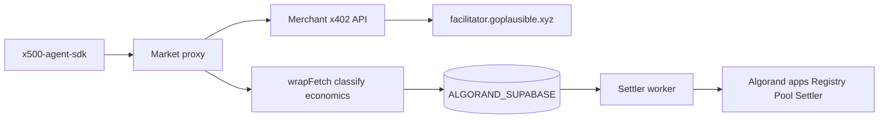

# x500 (Algorand)

Micro-insurance for AI agent API payments on **Algorand testnet**.

When a paid API call fails or breaches SLA after the agent paid, x500 refunds automatically via on-chain escrow — no support tickets, no manual claims.

| Rail | Asset | Mechanism |
|------|-------|-----------|
| Merchant API | **USDC** | x402 via [GoPlausible facilitator](https://facilitator.goplausible.xyz) |
| Insurance | **ALGO** | Prepaid escrow in `X500Pool` → `settleBatch` premiums / refunds |

**Network:** `algorand:testnet` · **Explorer:** [Lora](https://lora.algokit.io/testnet) · **Wallets:** Pera, Defly

---

## Packages

| Package | Role |
|---------|------|
| [`x500-agent-sdk`](packages/x500-agent-sdk) | Agent SDK — insured `fetch`, x402 USDC, ALGO escrow |
| [`x500-algorand`](packages/x500-algorand) | CLI (`x500-algorand`) for scripts and quick testing |

---

## Quick start

```bash
pnpm install
cp .env.example .env   # fill Algorand keys + ALGORAND_SUPABASE_*
pnpm db:migrate
pnpm protocol:deploy   # writes config/deployments.algorand.testnet.json
pnpm protocol:init
pnpm algorand:smoke
```

### Agent (minimal)

```ts
import { createX500 } from "x500-agent-sdk";

const x500 = createX500({
  network: "testnet",
  address: process.env.X500_AGENT_ADDRESS!,
  mnemonic: process.env.ALGORAND_AGENT_MNEMONIC!,
});

await x500.setup({ escrowMicroAlgos: 3_000_000n }); // 3 ALGO escrow
const res = await x500.fetch("https://your-merchant.example/paid/weather?city=Paris");
```

```bash
export X500_AGENT_ADDRESS=...
export ALGORAND_AGENT_MNEMONIC="25 word phrase ..."
npx x500-algorand --network testnet approve
npx x500-algorand --network testnet https://merchant.example/paid/weather?city=Tokyo
```

---

## Key scripts

| Script | Purpose |
|--------|---------|
| `pnpm algorand:smoke` | End-to-end health check (facilitator, indexer, deployments) |
| `pnpm protocol:deploy` | Deploy Registry / Pool / Settler apps to testnet |
| `pnpm protocol:init` | Grant settler role, wire protocol |
| `pnpm db:migrate` | Apply Postgres migrations to **Algorand Supabase** |
| `pnpm proxy:dev` | Local market proxy (`:8788`) |
| `pnpm indexer:dev` | Local indexer API (`:8787`) |
| `pnpm settler:dev` | Settlement worker |
| `pnpm dashboard:dev` | Merchant registration (Pera / Defly) |
| `pnpm example:server` | Demo merchant + ngrok |
| `pnpm example:agent` | LangChain agent demo |

---

## Architecture



1. **Agent** calls `{proxy}/v1/{slug}/...` with `x-x500-agent-address`.
2. **Proxy** forwards to merchant; merchant charges **USDC** via x402.
3. **wrap** classifies HTTP outcome, computes premium/refund in **microAlgos**, queues settlement.
4. **Settler** batches `settleBatch` on Algorand — debits agent ALGO escrow, refunds on covered breaches.

### Monorepo layout

| Package | Role |
|---------|------|
| `@x500/protocol-algorand-v1` | PyTeal / TEAL smart contracts |
| `@x500/protocol-algorand-v1-client` | Encoders, simulate helpers, deployment loader |
| `@x500/shared` | `AlgorandAdapter` — indexer reads + on-chain writes |
| `@x500/wrap` | `wrapFetch`, economics, `X-X500-*` headers |
| `@x500/classifier` | HTTP outcome → neutral category |
| `@x500/db-algorand` | Supabase client (`ALGORAND_SUPABASE_*`) |
| `@x500/indexer` | REST API + chain sync |
| `@x500/settler` | Batched `settleBatch` worker |
| `@x500/market-proxy` | Insured `/v1/{slug}/*` gateway |
| `@x500/dashboard` | Pera / Defly registration UI |

---

## Configuration

Copy [`.env.example`](.env.example). Critical vars:

| Variable | Purpose |
|----------|---------|
| `ALGORAND_NETWORK` | `algorand:testnet` |
| `FACILITATOR_URL` | `https://facilitator.goplausible.xyz` |
| `USDC_TESTNET_ASA_ID` | `10458941` |
| `ALGORAND_SUPABASE_*` | **Separate** Supabase project (not shared with other chains) |
| `X500_DEPLOYMENTS_PATH` | `config/deployments.algorand.testnet.json` |
| `X500_AGENT_ADDRESS` / `ALGORAND_AGENT_MNEMONIC` | Agent wallet |

Deployments: [`config/deployments.algorand.testnet.json`](config/deployments.algorand.testnet.json)

---

## Units

| Unit | Meaning |
|------|---------|
| **microAlgos** | 1 ALGO = 1,000,000 microAlgos (insurance premium / escrow / refund) |
| **microUSDC** | 1 USDC = 1,000,000 microUSDC (merchant x402 price) |

---

## Examples

- [`example/`](example/) — weather merchant server + LangChain agent
- [`packages/x500-agent-sdk/README.md`](packages/x500-agent-sdk/README.md) — SDK reference
- [`packages/x500-algorand/README.md`](packages/x500-algorand/README.md) — CLI reference

---

## Links

| Resource | URL |
|----------|-----|
| Lora explorer | https://lora.algokit.io/testnet |
| x402 facilitator | https://facilitator.goplausible.xyz |
| Algorand testnet faucet | https://bank.testnet.algorand.network/ |
